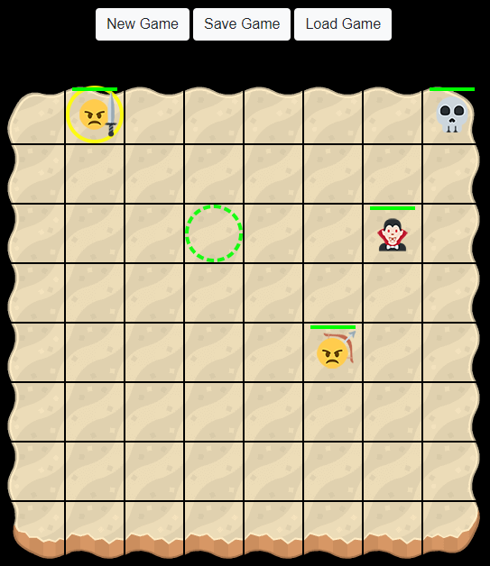
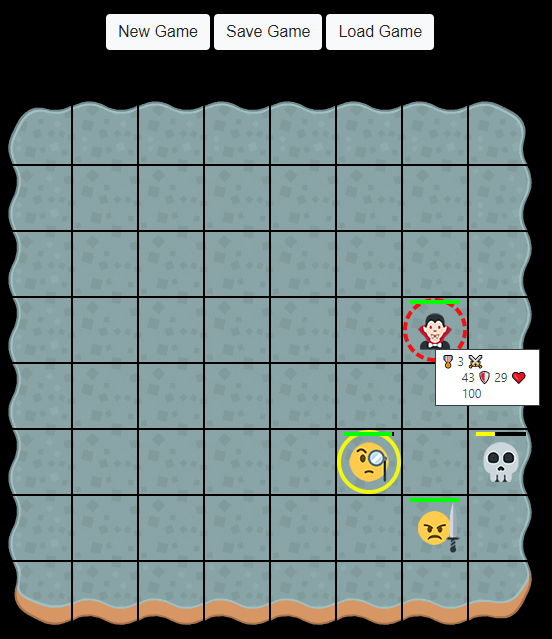

# Retro Game

[Play Game](https://deniskulik.github.io/retro-game/)

## Description

A two-dimensional fantasy game where the player has to put his characters against the characters of evil spirits. After each round, the life of the surviving player characters is restored and their level increases. The maximum level is 4. The start code and the task for the project are taken from the [repository](https://github.com/netology-code/js-advanced-diploma.git).

## Screenshots

<table align="center" border="0">

<tr>
<td>  </td>
<td>  </td>
</tr>

</table>

## Mechanics

The field size is fixed (8x8). The direction of movement is similar to the queen in chess. Characters of different types can walk at different distances (in the basic version, you can jump over other characters - that is, like a knight in chess, the only thing is that we walk in straight lines and diagonally):

- Swordsmen/Undeads - 4 cells in any direction;
- Bowmans/Vampires - 2 cells in any direction;
- Magicians/Demons - 1 cell in any direction.

The attack range is also limited. Cells are considered "by radius":

- Swordsmen/Undeads - only the neighboring cell is attacked;
- Bowmans/Vampires - for the next 2 cells;
- Magicians/Demons - for the next 4 cells.

The game ends when all the player's characters die, or the maximum level is reached.

The level ends with the player winning when all the computer characters have died.
